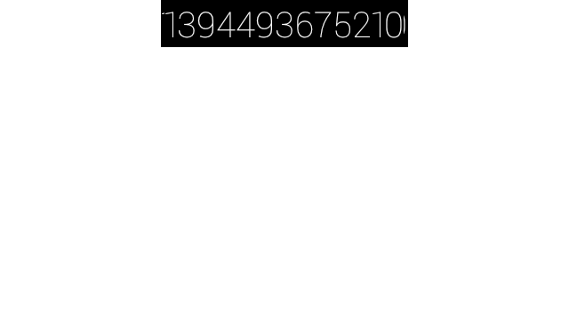

Hello Live Card
=======

This unofficial sample provides a minimal implementation of a GDK Live Card for
Google Glass. It displays the current system time at about 30 fps :)

This is just something that I hacked up as an experiment. Consider it
a snapshot sample. In other words, it's not actively maintained. It
last worked as of XE16.

## Usage

1. Install Android Studio (last tested with 0.5.5)
2. [Install the GDK Developer Preview add-on](https://developers.google.com/glass/develop/gdk/quick-start#setting_up_the_development_environment) using the Android SDK Manager
3. Clone this repository, or download the zip file
4. Open it using Android Studio
5. Install it on to your Glass
6. Use the 'Show me a demo' voice command to run the demo. 
    You should see a live card that looks something like this: 
7. Use this as a foundation for some other cool project.

## Learn More

Check out the
[official documentation](https://developers.google.com/glass/develop/index)
to learn how to develop for Glass.  There you'll find awesome docs,
better samples, and pictures of puppies. C'mon, what do you have to lose?
